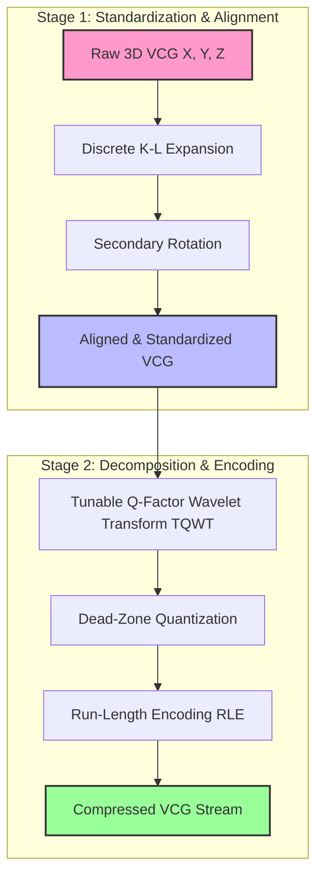

# 🫀 VCG Signal Compression: Discrete K-L Expansion & Tunable Quality Wavelet Transform

> **Paper Title:** A new VCG signal compression technique based on discrete Karhunen-Loeve expansion and tunable quality wavelet transform
> **Journal:** Journal of Electrocardiology (Published Online: 8 February 2025)
> **DOI:** [10.1016/j.jelectrocard.2025.153894](https://doi.org/10.1016/j.jelectrocard.2025.153894)

---

## 📌 Executive Summary
This paper introduces an innovative, high-fidelity **two-stage data compression framework** specifically designed for **Vectorcardiogram (VCG)** signals. VCG captures the heart's electrical activity in a three-dimensional plane (X, Y, Z leads), providing richer diagnostic details than a standard ECG, but generating significantly larger datasets. 

The proposed method achieves an impressive **Compression Ratio (CR) of 15.43** while maintaining an outstanding **Fidelity of 99.72%** and a low **Percent Root-mean-square Difference (PRD) of 7.39%**—well within the clinically acceptable limit of <10%.

---

## ⚙️ Proposed Compression Architecture

The technique works in two major stages:

### 🔹 Stage 1: Discrete Karhunen-Loeve (K-L) Expansion & Rotation
* **The Problem:** VCG shapes change between patients due to breathing (respiration) and varying physical heart orientations.
* **The Solution:** The raw 3D VCG signals undergo a discrete K-L expansion and secondary rotation.
* **Result:** Standardizes the coordinate system across different records, minimizes inter-patient variability, and concentrates the signal's energy into a few principal dimensions, preserving core diagnostic features.

### 🔹 Stage 2: Tunable Q-Factor Wavelet Transform (TQWT) & Encoding
* **TQWT Decomposition:** Exploits the non-stationary and multiscale nature of VCG data. By using adjustable parameters (**Q-factor = 4**, **redundancy = 1.2**, and **6 decomposition stages**), it balances time and frequency resolution.
* **Quantization:** Converts the wavelet coefficients into sparse forms (producing long runs of zeros).
* **Run-Length Encoding (RLE):** Highly efficient at compressing consecutive zero coefficients, maximizing storage reduction.

---

## 📈 Performance Comparison & Literature Review

The proposed method shows clear superiority over previous compression techniques evaluated on the standard **PTB Diagnostic ECG Database**:

| Compression Scheme | Compression Ratio (CR) | Signal Quality (PRD / Distortion) | Reconstruction Fidelity | Key Characteristics / Limitations |
| :--- | :---: | :---: | :---: | :--- |
| **Proposed Method (K-L + TQWT + RLE)** | **15.43** | **7.39%** (Good) | **99.72%** | **High efficiency, fast (0.076s per record), real-time ready.** |
| Wavelet + Zero-Zone + Huffman | Moderate | Low | High | Standard energy packing, but complex Huffman tables. |
| Wavelet + Dead-Zone + Modified RLE | High | Moderate | Medium | Improved CR but higher distortion. |
| Walsh-Hadamard / DCT | 2.0 – 5.0 | High | Low | Low compression performance. |
| Huffman + DCT | 3.02 – 4.15 | 16.9% – 17.2% (Unsatisfactory) | Low | High distortion (PRD > 10% is clinically unacceptable). |
| VLSI Architecture | 3.857 – 4.45 | Low | High | Targetted for low-power hardware, but low CR. |

---

## 🧮 Core Evaluation Metrics

To assess signal quality after compression, the research employs standard quantitative metrics:

### 1. Percent Root-mean-square Difference (PRD)
Measures the distortion between the original and reconstructed signal. Values under 10% are clinically acceptable.
$$PRD = \sqrt{\frac{\sum_{t=1}^{N} (x(t) - \hat{x}(t))^2}{\sum_{t=1}^{N} x(t)^2}} \times 100\%$$

### 2. Peak Signal-to-Noise Ratio (PSNR)
Measures reconstruction power relative to noise. The proposed method achieves **37.38 dB**.
$$PSNR = 20 \log_{10} \left( \frac{x_{\max} - x_{\min}}{\text{RMSE}} \right)$$

### 3. Compression Ratio (CR)
The ratio of raw data size to compressed data size.
$$CR = \frac{\text{Uncompressed File Size}}{\text{Compressed File Size}}$$

---

## 💡 Clinical Relevance & Target Application
Because of the low computational complexity (only **0.076 seconds** processing time per record), this method is ideal for:
1. **Low-power Wearable Health Devices**: Real-time continuous cardiac monitoring.
2. **Ambulatory Systems**: Holter monitors or mobile cardiac telemetry.
3. **Telemedicine**: Transmitting high-quality 3D cardiac diagnostics over low-bandwidth cellular networks without risking signal degradation.
