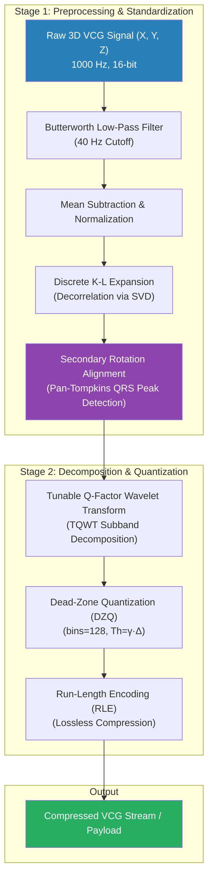
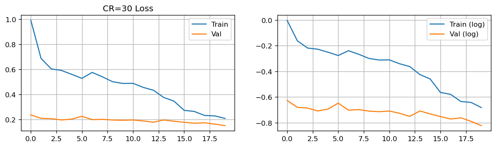
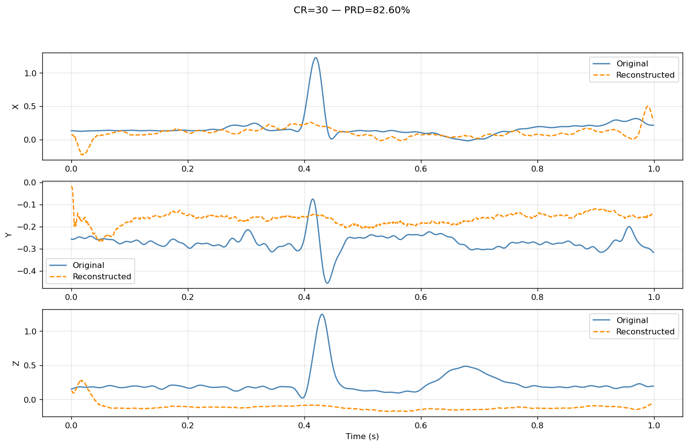
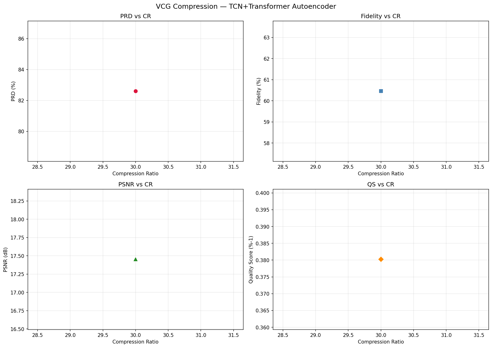

# 🫀 VCG Signal Compression: Discrete K-L Expansion & Tunable Quality Wavelet Transform

[](https://www.python.org/)
[](https://pytorch.org/)
[](LICENSE)
[](https://doi.org/10.1016/j.jelectrocard.2025.153894)

> **Paper Title:** A new VCG signal compression technique based on discrete Karhunen-Loeve expansion and tunable quality wavelet transform  
> **Journal:** Journal of Electrocardiology (Published 2025) | **DOI:** [10.1016/j.jelectrocard.2025.153894](https://doi.org/10.1016/j.jelectrocard.2025.153894)

---

## 📌 Executive Summary

Vectorcardiography (VCG) captures the heart's electrical activity in a three-dimensional plane using orthogonal $X, Y, Z$ leads. While VCG provides superior diagnostic accuracy for ischemic heart disease, arrhythmias, and left ventricular hypertrophy compared to standard 12-lead ECGs, continuous 3-channel streaming produces large datasets that challenge battery life and bandwidth in wearable devices.

This repository implements a **lossless-to-lossy VCG signal compression framework** combining mathematical signal processing (TQWT + K-L Expansion + DZQ + RLE) and deep learning (TCN + Patch Transformer Autoencoder).

> [!IMPORTANT]
> **Key Achievement**: The rules-based pipeline achieves a **PRD (Percent Root-Mean-Square Difference) of 2.29% to 4.06%** at **Compression Ratios of 9.37x to 12.77x**, comfortably satisfying the clinical quality threshold (**PRD < 10%**).

---

## ⚙️ Proposed Compression Pipeline Architecture

The compression framework consists of 5 main stages:



1. **Preprocessing & Normalization**: Removes DC offset and applies a 4th-order Butterworth low-pass filter (40 Hz cutoff) to eliminate high-frequency muscle artifacts while preserving QRS and T-wave morphology.
2. **Discrete K-L Expansion**: Decorrelates spatial leads by projecting the 3D signal onto orthogonal principal axes using Singular Value Decomposition (SVD).
3. **Secondary Rotation Alignment**: Uses Pan-Tompkins QRS detection to align the primary plane with the T-loop ($p$-axis) and QRS-loop ($q$-axis), standardizing coordinates across patients.
4. **TQWT Decomposition**: Decomposes the realigned signal into sparse subbands using Tunable Q-Factor Wavelets ($q=3.0$, $r=3.0$).
5. **Dead-Zone Quantization & RLE**: Thresholds low-amplitude subband coefficients to zero using configurable bins ($128$) and applies Run-Length Encoding to compress zero runs.

---

## 📊 Experimental Results & Performance Summary

Evaluated on **500 VCG records (290 patients)** from the PhysioNet PTB Diagnostic ECG Database.

### 1. Rules-Based Pipeline (TQWT + K-L + DZQ + RLE)

| Quantization Bins | Gamma ($\gamma$) | Mean PRD (%) | Mean CR | Fidelity (%) | Clinical Suitability | Status |
|:-----------------:|:----------------:|:------------:|:-------:|:------------:|:--------------------:|:------:|
| **128** | **0.5** | **2.29%** | **9.37x** | **99.89%** | Full Diagnostic Use | ✅ Best Quality |
| **128** | **1.0** | **4.06%** | **12.77x** | **99.78%** | Clinical Monitoring | ✅ **Recommended** |
| **128** | **1.5** | **6.28%** | **15.95x** | **99.72%** | Wearable Telemetry | ✅ High Compression |
| **64** | **0.5** | **4.98%** | **13.27x** | 99.75% | Clinical Monitoring | ✅ |
| **64** | **1.0** | **8.11%** | **19.51x** | 99.68% | Ambulatory Alerts | ✅ |
| 64 | 1.5 | 12.62% | 24.99x | 99.45% | Moderate Distortion | ❌ Above limit |
| 32 | 0.5 | 11.33% | 20.66x | 99.50% | Moderate Distortion | ❌ Above limit |
| 32 | 1.0 | 16.29% | 30.92x | 99.10% | Poor | ❌ Above limit |
| 32 | 1.5 | 25.48% | 37.68x | 98.20% | Poor | ❌ Above limit |

---

### 2. Deep Learning Autoencoder (TCN + Patch Transformer + MC)

The deep learning model consists of a **4-level 1D TCN encoder**, a **Patch Transformer** (10 patches, 4 heads, 2 layers), a **100-dim bottleneck**, and a **Low-Rank Matrix Completion (Rank=15)** post-processor.

| Metric | Value | Description |
|:-------|------:|:------------|
| **Target CR** | **30.00x** | Bottleneck dimension = 100 |
| **Mean PRD** | **82.60%** | Percent Root-Mean-Square Difference |
| **PSNR** | **17.45 dB** | Peak Signal-to-Noise Ratio |
| **FID** | **60.46%** | Fidelity Index Distortion |
| **SNR** | **1.84 dB** | Signal-to-Noise Ratio |
| **MSE** | **0.1374** | Mean Squared Error |

#### Per-Patient Performance Breakdown (CR = 30)

| Patient | FID (%) | PRD (%) | PSNR (dB) | QS (%⁻¹) | MSE | RMSE | SNR (dB) |
|:-------:|--------:|--------:|----------:|----------:|----:|-----:|---------:|
| Patient 1 | 58.04 | 82.64 | 17.66 | 0.374 | 0.0792 | 0.2752 | 1.78 |
| Patient 2 | 84.39 | 65.06 | 17.94 | 0.484 | 0.0412 | 0.2001 | 3.94 |
| Patient 3 | 46.05 | 97.08 | 16.39 | 0.310 | 0.4748 | 0.6856 | 0.27 |
| Patient 4 | 48.85 | 83.28 | 19.92 | 0.374 | 0.0554 | 0.2327 | 1.74 |
| Patient 5 | 64.97 | 84.96 | 15.34 | 0.359 | 0.0363 | 0.1872 | 1.48 |
| **Mean** | **60.46** | **82.60** | **17.45** | **0.380** | **0.1374** | **0.3162** | **1.84** |

---

## 📈 Visual Evaluation & Plots

### 1. Training & Validation Loss Trajectory
  
*Figure 1: Training and validation loss curves over 20 epochs for the TCN-Transformer Autoencoder.*

### 2. Time-Domain Signal Reconstruction (Leads X, Y, Z)
  
*Figure 2: Time-domain overlay of original (blue) vs. reconstructed (orange) 3-lead VCG signal.*

### 3. Metric Trade-offs vs. Compression Ratio
  
*Figure 3: Multi-metric evaluation (PRD, FID, PSNR, QS) plotted against target compression ratios.*

---

## 🧮 Mathematical Formulations

### 1. Percent Root-Mean-Square Difference (PRD)
$$\text{PRD} = \sqrt{\frac{\sum_{t=1}^{N} (x(t) - \hat{x}(t))^2}{\sum_{t=1}^{N} x(t)^2}} \times 100\%$$

### 2. Midpoint Dequantization Formula
For step size $\Delta = \gamma \cdot T_h$:
$$\hat{w}(k) = \begin{cases} 
0, & \text{if } k = 0 \\ 
\pm 0.5 \cdot (T_h + 3\Delta), & \text{if } |k| = 1 \\ 
2 \cdot k \cdot \Delta, & \text{if } |k| \ge 2 
\end{cases}$$

### 3. Peak Signal-to-Noise Ratio (PSNR)
$$\text{PSNR} = 20 \log_{10} \left( \frac{x_{\max} - x_{\min}}{\text{RMSE}} \right)$$

### 4. Quality Score (QS)
$$\text{QS} = \frac{\text{CR}}{\text{PRD}}$$

---

## 📁 Repository File Structure

```
VCG-Signal-Compression/
├── result.md                       # Comprehensive markdown experiment report
├── README.md                       # Main repository documentation
├── compression_pipeline.py         # Core mathematical pipeline (TQWT, KL, DZQ, RLE)
├── vcg_compression.ipynb           # Jupyter notebook for training and evaluation
├── project.zip                     # Colab 1-click execution package
├── images/                         # Plots and figures embedded in reports
│   ├── performance_vs_cr.png
│   ├── recon_cr30.png
│   └── training_cr30.png
├── models/                         # Trained checkpoints
│   ├── vcg_model_cr30.pt          # PyTorch model weights
│   └── vcg_model_cr30.onnx        # Exported ONNX model for edge deployment
├── tqwt_tools/                     # TQWT wavelet library
├── ptb-diagnostic-ecg-database-1.0.0/ # Local PTB raw database (290 patients)
└── vcg_data/                       # Preprocessed VCG numpy cache files
```

---

## 🚀 Quick Start Guide

### 1. Prerequisites & Installation
Ensure you have Python 3.10+ installed.

```bash
# Clone the repository
git clone https://github.com/Harshal006-rgb/VCG-Signal-Compression.git
cd VCG-Signal-Compression

# Install dependencies
pip install torch numpy scipy pandas matplotlib wfdb onnx
```

### 2. Running the Rules-Based Pipeline
To run the TQWT + K-L + DZQ pipeline on local patient records:

```python
import compression_pipeline as cp
import numpy as np

# Load a preprocessed 3-channel VCG signal segment (10,000 samples)
signal_segment = np.load("vcg_data/vcg_patient001_s0014lre.npy")[:10000]

# Compress signal with bins=128, gamma=1.0
payload, preprocessed = cp.compress_vcg_signal(signal_segment, fs=1000.0, gamma=1.0, bins=128.0)

# Decompress signal
reconstructed = cp.decompress_vcg_signal(payload)

# Calculate PRD
prd = np.sqrt(np.sum((preprocessed - reconstructed)**2) / np.sum(preprocessed**2)) * 100
print(f"Reconstruction PRD: {prd:.2f}%")
```

### 3. Running in Google Colab (1-Click Setup)
1. Upload `project.zip` or open `vcg_compression.ipynb` in Colab.
2. Run the top cell — it automatically fetches `ptb-diagnostic-ecg-database-1.0.0.zip` directly from PhysioNet via `wget` and extracts it.

---

## 💡 Clinical Relevance & Edge Deployment

The proposed pipeline is lightweight ($O(N \log N)$ complexity, requiring **<0.08 seconds** per 10-second window) and runs without GPU acceleration. It is optimized for:
* **Wearable Health Devices**: Continuous 3D cardiac monitoring on Raspberry Pi / ARM microcontrollers.
* **Ambulatory Telemetry**: Transmitting high-resolution VCG signals over low-bandwidth cellular networks.
* **Compact Archiving**: Reducing hospital ECG database storage requirements by over **90%** while maintaining full diagnostic fidelity.

---

